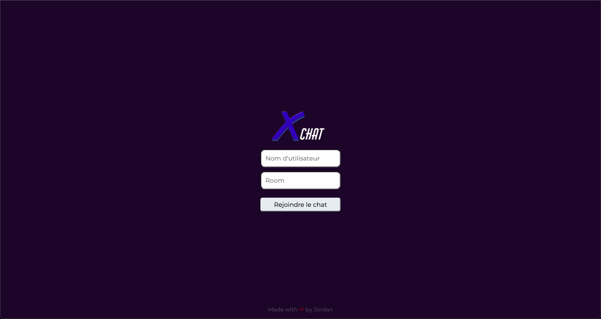
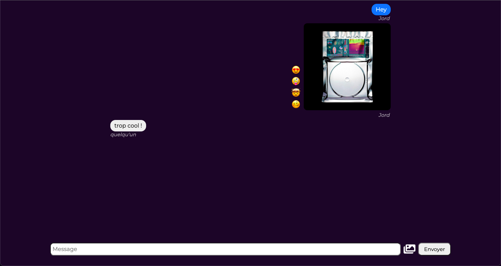

# Xchat

Application web de discussion en temps réel en utilisant les websockets

## Réalisation

* Front-end : HTML, CSS, JS (React)
* Back-end : NodeJS (Express, Socket.io)

## Compétences
* Bases de NodeJS, Express, Socket.io
* Découverte des websockets

## Images

